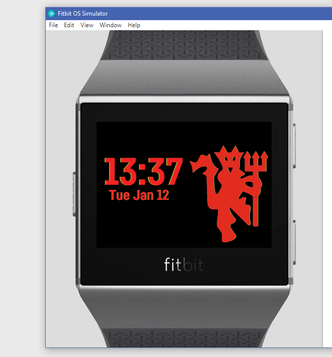

# Fitbit_watchfaces

Fitbit ionic watch faces I've made for my smartwatch using FITBIT SDK

FinalFantasy 7 inspired watchface: 

Can cycle through characters with an onClick event.
Uses fitbit library to keep track of heart rate and has bars to show battery/progress towards goal.  

 

Dark Souls Inspired watchface:
Has an animated gif, keeps track of heart rate, battery, and goal progress.
Bottom right has a carousel that cycles through fitness metrics.  

Beginner project, displays time, date, and an image.  

